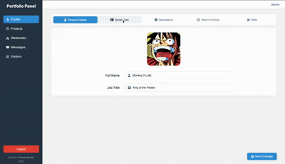
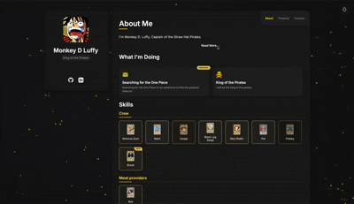

# Bonnici Portfolio v0.4.3

A modern, responsive portfolio website built with FastAPI and SQLAlchemy.

## Screenshots

### Admin Panel


### User Portfolio


## Features

- Modern UI with responsive design
- Contact form with database storage
- Discord webhook notifications
- Docker containerization
- Secure admin panel with token-based authentication

## Latest Updates

See the [CHANGELOG.md](CHANGELOG.md) file for details on the latest changes and updates.

## Development

### Setup with PDM

```bash
# Install dependencies
pdm install

# Run development server
pdm run front

# Run admin panel
pdm run admin

# Generate admin token
pdm run generate_admin_password
```

### Admin Authentication

The admin panel is protected by a secure token-based authentication system:

1. Generate an admin token using `pdm run generate_admin_password`
2. Save the token securely - it will only be shown once
3. Access the admin panel at `http://localhost:85`
4. Log in using the token
5. Your session will remain valid for 6 months

Security features:
- HTTPS-only secure cookies
- Token hashing (only hashes stored in database)
- Automatic session invalidation when a new token is generated

### Docker Deployment

```bash
# Build and start both front and admin services
docker-compose up -d

# View logs for all services
docker-compose logs -f

# View logs for a specific service
docker-compose logs -f front
docker-compose logs -f admin

# Stop all services
docker-compose down
```

The Docker setup runs two services:
- Front service: Available at http://localhost:84
- Admin service: Available at http://localhost:85

Both services share the same database volume for data persistence.

#### Admin Token in Docker

When running with Docker, the admin token is automatically generated when the admin service starts. To get your token:

1. Start the services with `docker-compose up -d`
2. View the admin service logs to find your token:
   ```bash
   docker-compose logs admin
   ```
3. Look for the section marked with "New admin token generated successfully!"
4. Save the token securely - it will be needed to log in to the admin panel
5. If you need to generate a new token later, you can run:
   ```bash
   docker-compose exec admin pdm run generate_admin_password
   ``` 